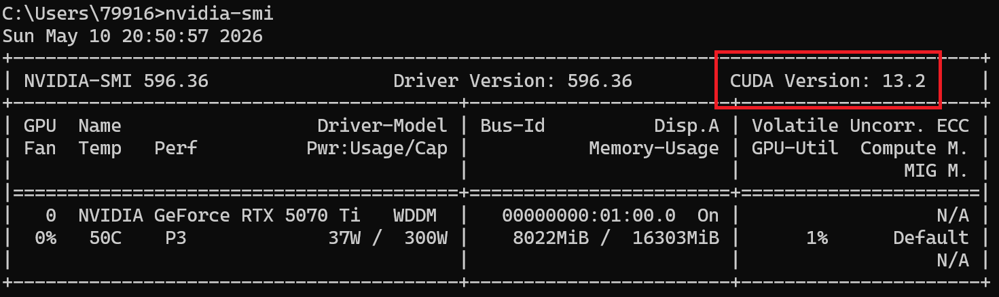
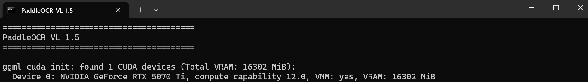
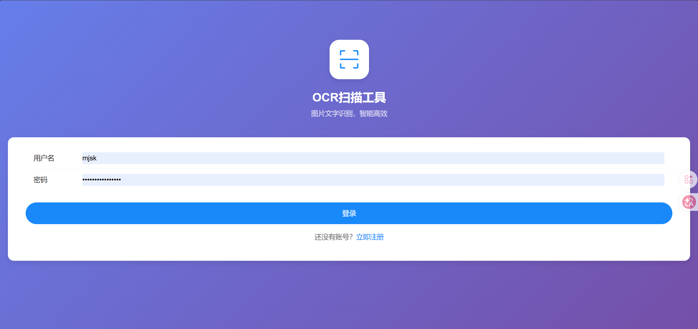
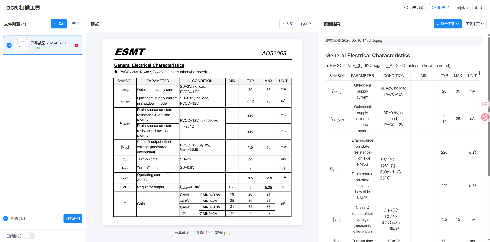
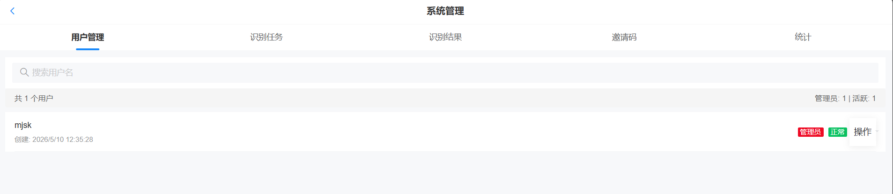
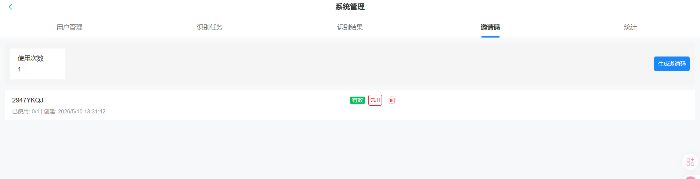

# OCR扫描工具 Web版

基于 PaddleOCR-VL 的前后端分离 Web 应用，支持手机/浏览器访问，实现图片上传、PDF导入、OCR识别、结果渲染（含数学公式）、多格式导出、历史记录管理、管理员后台等功能。

## 功能特性

### 用户端

- 用户注册/登录（邀请码机制）
- 修改密码（用户名下拉菜单）
- 图片批量上传（JPG/PNG/BMP/WebP/TIFF）
- PDF 导入（自动渲染为图片，逐页识别）
- OCR 文字识别（基于 PaddleOCR-VL 视觉语言模型）
- 识别结果实时进度展示（轮询 + 进度百分比）
- 结果渲染：Markdown 标题、粗斜体、表格、图片、**LaTeX 数学公式（KaTeX 渲染）**
- 单页下载（Markdown / HTML / JSON / Word）
- 整合下载（多结果合并打包 ZIP）
- 文件预览 + 旋转、拖拽排序、单独重试失败项
- 识别历史记录：展开查看、图片预览、批量/单个删除、多格式导出

### 管理员端
- 用户管理：搜索、角色变更（管理员↔普通用户）、启用/禁用、删除
- 识别任务管理：按用户名搜索、展开查看任务内结果、批量/单个删除（级联删除结果）
- 识别结果管理：按用户名搜索、批量/单个删除
- 邀请码管理：生成、启用/禁用、删除
- 系统统计面板

## 技术栈

### 后端
| 组件 | 技术 |
|------|------|
| Web 框架 | FastAPI |
| ORM | SQLAlchemy |
| 数据库 | SQLite |
| 认证 | JWT (bcrypt + python-jose) |
| OCR 引擎 | PaddleOCR-VL (via llama-cpp-server) |
| PDF 渲染 | pypdfium2 (200 DPI) |
| Word 导出 | pandoc (HTML→DOCX) |
| 公式渲染 | KaTeX (CDN，前端) |

### 前端
| 组件 | 技术 |
|------|------|
| 框架 | Vue 3 |
| UI 组件库 | Vant 4 |
| 状态管理 | Pinia |
| HTTP 客户端 | Axios |
| 构建工具 | Vite |
| 路由 | Vue Router (keep-alive 缓存主页状态) |
| 公式渲染 | KaTeX auto-render (CDN) |

## 项目结构

```
OCR扫描工具服务器/
├── backend/                     # 后端服务
│   ├── main.py                 # 应用入口、启动事件、迁移、默认管理员
│   ├── config.py               # 配置文件（Pydantic Settings）
│   ├── database.py             # 数据库配置、init_db、自动迁移
│   ├── models/                 # 数据模型
│   │   ├── user.py             # 用户模型
│   │   ├── task.py             # OCR任务模型（含软删除）
│   │   ├── result.py           # OCR结果模型
│   │   └── invitation_code.py  # 邀请码模型
│   ├── schemas/                # Pydantic 请求/响应模型
│   │   ├── user.py             # 用户认证相关
│   │   ├── task.py             # 任务相关 + BatchIds
│   │   └── result.py           # 结果 + 导出相关
│   ├── routers/                # API 路由
│   │   ├── auth.py             # 认证：注册/登录/个人信息/密码修改/用户管理
│   │   ├── upload.py           # 文件上传（图片+PDF）
│   │   ├── ocr.py              # OCR任务：提交/重试/轮询/任务列表/删除(软)/WebSocket
│   │   ├── export.py           # 导出下载：单页/合并ZIP
│   │   ├── admin.py            # 管理后台：任务/结果/统计/批量删除
│   │   └── invitation_codes.py # 邀请码管理
│   ├── services/               # 业务逻辑
│   │   ├── ocr_service.py      # PaddleOCRVL 封装、ExportService（Markdown→HTML）
│   │   └── pdf_service.py      # PDF 页面渲染服务
│   ├── utils/                  # 工具函数
│   │   └── security.py         # JWT 认证、密码哈希、权限依赖
│   ├── uploads/                # 上传文件存储
│   └── exports/                # 导出文件存储
│
├── frontend/                   # 前端应用
│   ├── index.html              # 入口（KaTeX CDN 加载）
│   ├── src/
│   │   ├── App.vue             # 根组件（keep-alive 缓存主页）
│   │   ├── views/              # 页面组件
│   │   │   ├── Login.vue       # 登录页
│   │   │   ├── Register.vue    # 注册页（邀请码）
│   │   │   ├── Home.vue        # 主页（三栏布局：文件列表/预览/结果）
│   │   │   ├── History.vue     # 识别历史（展开/导出/删除/批量操作）
│   │   │   ├── Admin.vue       # 管理后台（5个标签页）
│   │   │   └── Result.vue      # 结果详情页
│   │   ├── stores/             # Pinia 状态管理
│   │   │   ├── user.js         # 用户认证状态
│   │   │   └── ocr.js          # OCR 数据缓存 + API 代理
│   │   ├── api/                # Axios 实例（拦截器、错误处理）
│   │   │   └── index.js
│   │   └── router/             # 路由配置（导航守卫）
│   │       └── index.js
│   └── package.json
│
├── start_backend.bat           # 启动后端脚本
├── start_frontend.bat          # 启动前端脚本
├── start_all.bat               # 一键启动脚本
└── README.md
```

## 快速开始

### 前置条件

1. 安装最新的anaconda，官网地址：[Download Success | Anaconda](https://www.anaconda.com/download/success?reg=skipped)

2. 安装**Node.js 18+**，官网地址：[Node.js — 让 JavaScript 无处不在 - Node.js 运行环境](https://node.org.cn/en)

3. 安装 **pandoc**（Word 导出依赖），官网地址：[Pandoc - Installing pandoc](https://pandoc.org/installing.html)，安装后重启终端确保 `pandoc --version` 可执行。

4. 更新英伟达显卡驱动到最新版本。

5. 安装codatoolkit, 官网地址：[CUDA Toolkit 13.2 Update 1 Downloads | NVIDIA Developer](https://developer.nvidia.com/cuda-downloads)，具体安装版本可以通过在cmd命令行输入 `nvidia-smi` 来查看，确保安装的ToolKit版本小于等于下图红框的版本即可，安装完成后可以通过cmd命令行输入`nvcc -V`来查看安装的版本。

   

6. 下载PaddleOCR模型包以及llamacpp整合包并**解压**到工程目录（通过网盘分享的文件：paddleOCR-Model.zip
   链接: https://pan.baidu.com/s/1jFUzj_ORduF_UbbkTnbk7A?pwd=4tr4 提取码: 4tr4 
   
7. 点击运行整合包里的`startPaddleOCR.bat` 出现下图所示的`found 1 CUDA devices`代表英伟达显卡被正常识别，也可以通过任务管理器查看英伟达显卡显存的占用情况来确认独立显卡是否被正常识别，否则重新按照步骤3步骤4检查驱动安装情况。



### 启动OCR服务（Windows）

1、首先运行`setup_env.bat`，脚本会自动检测anaconda安装环境并安装所有依赖库（建议挂梯子或者切换国内源） ，如果脚本检测不到anaconda安装环境会提示用户手动输入anaconda的安装路径。

2、点击`start_all.bat`运行前后端服务，

后端运行在 http://localhost:8000

前端运行在 http://localhost:5173 , 浏览器输入该地址就能访问，默认用户名`mjsk`  默认密码`mjsk`



3、登录后主界面如下图：

- 右侧窗口显示当前上传的文件（支持图片和pdf）。
- 中间窗口显示图片预览效果（可以点击右上角的左旋和右旋来调整图片角度）。
- 左侧窗口显示识别后的预览效果，支持整合下载（将所有文件拼合在一起）和单页下载为 markdown、html、json、word 格式。



4、管理员账号支持后台管理，点击`管理后台`按钮即可进入后台管理界面，支持用户管理、识别任务管理、以及邀请码管理和统计。注册新用户需要管理员生成邀请码。





### 方式三：Docker 部署（暂未测试）

```bash
docker-compose up -d
```

## 访问地址

| 地址 | 说明 |
|------|------|
| http://localhost:5173 | 前端页面 |
| http://localhost:8000 | 后端 API |
| http://localhost:8000/docs | API 文档（Swagger） |
| http://localhost:7950 | OCR 推理服务 |

**手机访问**：确保手机和电脑在同一局域网，使用电脑 IP 访问 `http://<电脑IP>:5173`。

## API 接口

### 认证
| 方法 | 路径 | 说明 | 权限 |
|------|------|------|------|
| POST | `/api/auth/register` | 用户注册（需邀请码） | 公开 |
| POST | `/api/auth/login` | 用户登录 | 公开 |
| GET | `/api/auth/me` | 获取当前用户信息 | 登录 |
| PUT | `/api/auth/me/password` | 修改密码（需旧密码） | 登录 |
| GET | `/api/auth/users` | 用户列表 | 管理员 |
| PUT | `/api/auth/users/{id}/role` | 变更用户角色 | 管理员 |
| PUT | `/api/auth/users/{id}/status` | 启用/禁用用户 | 管理员 |
| DELETE | `/api/auth/users/{id}` | 删除用户 | 管理员 |

### 文件上传
| 方法 | 路径 | 说明 |
|------|------|------|
| POST | `/api/upload/images` | 上传图片/PDF（PDF自动渲染为图片） |
| GET | `/api/upload/images` | 获取待识别的已上传图片 |
| DELETE | `/api/upload/images/{id}` | 删除已上传图片 |

### OCR 识别
| 方法 | 路径 | 说明 | 权限 |
|------|------|------|------|
| POST | `/api/ocr/recognize` | 提交识别任务 | 登录 |
| POST | `/api/ocr/retry` | 重试失败项 | 登录 |
| GET | `/api/ocr/tasks` | 任务列表（隐藏软删除） | 登录 |
| GET | `/api/ocr/tasks/{id}` | 任务详情 | 登录 |
| DELETE | `/api/ocr/tasks/{id}` | 删除任务（软删除，管理员仍可查看） | 登录 |
| POST | `/api/ocr/tasks/batch-delete` | 批量软删除任务 | 登录 |
| GET | `/api/ocr/results` | 已完成结果列表 | 登录 |
| GET | `/api/ocr/results/all` | 所有结果（含失败） | 登录 |
| GET | `/api/ocr/results/{id}` | 单个结果详情 | 登录 |
| DELETE | `/api/ocr/results/{id}` | 删除单个结果 | 登录 |
| WS | `/api/ocr/ws/{user_id}` | WebSocket 进度推送 | 登录 |

### 导出下载
| 方法 | 路径 | 说明 |
|------|------|------|
| POST | `/api/export/download` | 导出单页/多结果（MD/JSON/HTML/Word） |
| POST | `/api/export/merge` | 整合下载（合并结果+图片打包 ZIP） |

### 管理后台
| 方法 | 路径 | 说明 |
|------|------|------|
| GET | `/api/admin/tasks` | 所有用户任务（含用户名，可按用户搜索） |
| GET | `/api/admin/tasks/{id}/results` | 任务内结果列表（展开查看） |
| DELETE | `/api/admin/tasks/{id}` | 删除任务（硬删除，级联删除结果） |
| POST | `/api/admin/tasks/batch-delete` | 批量删除任务 |
| GET | `/api/admin/results` | 所有用户结果（可按用户搜索） |
| DELETE | `/api/admin/results/{id}` | 删除单个结果 |
| POST | `/api/admin/results/batch-delete` | 批量删除结果 |
| GET | `/api/admin/stats` | 系统统计（用户数/任务数/结果数） |
| POST/GET/DELETE | `/api/admin/invitation-codes/` | 邀请码 CRUD |

## 配置说明

### 环境变量（`backend/.env`）

```env
# JWT 密钥（生产环境必须修改为随机字符串）
SECRET_KEY=your-secret-key-change-in-production

# OCR 推理服务地址
OCR_SERVER_URL=http://127.0.0.1:7950/v1

# CORS 允许的来源（多前端地址）
CORS_ORIGINS=["http://localhost:5173","http://localhost:3000"]
```

### 默认管理员

首次启动自动创建：用户名 `mjsk`，密码通过 `backend/.env` 的 `SECRET_KEY` 环境变量配置。

## 架构设计要点

### 软删除机制
用户删除历史记录时，仅设置 `deleted_at` 时间戳，数据不从数据库移除。管理员仍可查看所有数据（含已删除），保证审计追溯能力。管理员删除时执行硬删除，级联移除关联结果。

### 公式渲染管线
1. PaddleOCR 输出 `$...$` / `$$...$$` 格式的 LaTeX 公式
2. 前端 `renderHtml()` 和后端 `_md_to_html()` 转换为 KaTeX 定界符 `\(...\)` / `\[...\]`
3. 前端 `renderMathInElement()` 调用 KaTeX auto-render 渲染为 SVG/HTML 数学公式
4. 后端 HTML 导出直接输出 KaTeX 可渲染的定界符格式
5. Word (.docx) 导出通过 pandoc HTML→DOCX 转换，公式、表格、图片均由 pandoc 原生支持
| pandoc | Markdown→HTML→DOCX 转换 (Word 导出) |

### 线程安全
- OCR 管道初始化使用 `threading.Lock` 双重检查，防止多线程并行初始化导致 GPU 资源竞争
- `ThreadPoolExecutor(max_workers=1)` 确保 GPU 推理串行执行
- 应用关闭时调用 `executor.shutdown(wait=True)` 等待当前任务完成

### Keep-Alive 缓存
主页组件通过 `<keep-alive>` 缓存，切换历史记录/管理后台后返回时保留文件列表、识别结果等状态，无需重新加载。

## 数据流

```
用户上传文件 → 存储到 uploads/{user_id}/
  ├── 图片：直接存储
  └── PDF：pypdfium2 逐页渲染为 PNG

前端提交识别 → POST /api/ocr/recognize
  ├── 创建 OCRTask + 关联 OCRResult
  ├── ThreadPoolExecutor 异步执行 OCR
  ├── PaddleOCRVL 调用 llama-server 推理
  └── 结果存入 markdown_text / json_data 字段

前端轮询进度 → GET /api/ocr/tasks/{id}
  └── 任务完成 → 加载结果 → renderHtml() → renderMathInElement()

用户导出 → POST /api/export/download 或 /merge
  └── ExportService 生成 Markdown/HTML/JSON → FileResponse 或 ZIP
```

## 常见问题

### 1. OCR 识别失败
检查 llama-server 是否运行：
```bash
curl http://localhost:7950/v1/models
```

### 2. PDF 识别异常
确保已安装 `pypdfium2`：
```bash
pip install pypdfium2
```

### 3. GPU 初始化失败
检查 `start_backend.bat` 中 Conda 环境是否正确，确保 `paddlepaddle-gpu` 版本匹配 CUDA 版本。

### 4. 数据库重置
删除 `backend/ocr_web.db` 后重启后端，自动重建数据库。

### 5. 公式不渲染
确保 KaTeX CDN 可访问（需网络），或下载到本地 `frontend/public/` 目录并修改 `index.html` 引用路径。

## 许可证

MIT License
